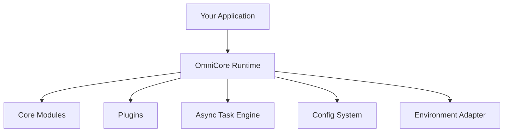
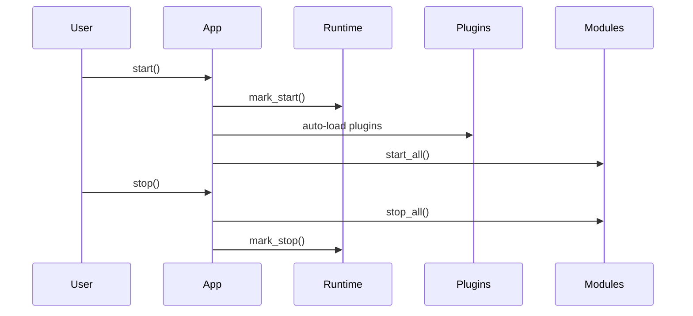
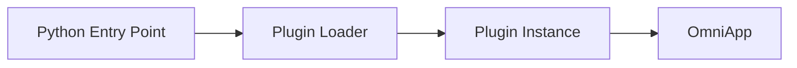
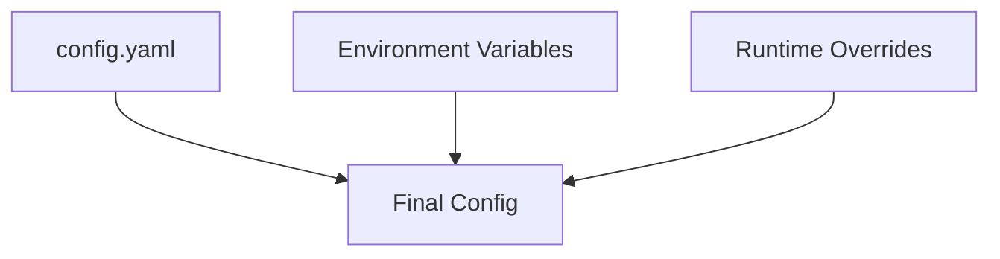
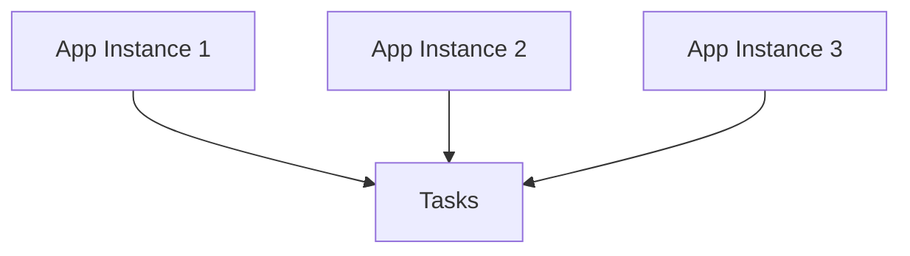

# OmniCore

OmniCore is a modular, scalable, and portable application runtime framework that serves as a foundation layer for building modern software systems.

Unlike traditional frameworks focused on a single domain (web, ML, logging), OmniCore provides a core runtime platform that applications extend via modules, plugins, async execution, and environment adapters. It is industry-oriented, production-safe, and designed for long-term evolution.

---

## What OmniCore Actually Does

OmniCore provides a structured runtime that:
- Manages application lifecycle (start, stop, graceful shutdown)
- Enables plug-and-play capabilities via modules
- Supports third-party extensibility through plugins
- Runs async and concurrent workloads with worker pools
- Loads configuration from files, environment variables, and overrides
- Runs consistently across local, cloud, container, and edge environments

OmniCore is the operating layer your application runs on.

---

## High-Level Architecture



---

## Application Lifecycle



---

## Core Concepts

### Core Runtime
- Tracks runtime identity and uptime
- Coordinates all subsystems
- Defines lifecycle boundaries

### Modules
- First-class, lifecycle-managed components
- Used for health, configuration, metrics, caching, messaging, etc.
- Deterministic startup and shutdown

### Plugins
- Third-party extensions
- Auto-discovered via Python entry points
- Loaded dynamically and isolated from failures

### Async Task Engine
- Background task execution
- Worker pools for concurrency
- Non-blocking workloads suitable for APIs and services

### Environment Adapters
- Abstract local, cloud, and container environments
- Enable portability without code changes

---

## Installation

pip install omnicore

---

## Quick Start

Create a new project

omnicore new myapp
cd myapp

Run the application

omnicore run

---

## Minimal Example

from omnicore.core.app import OmniApp
from omnicore.modules.health import HealthModule

app = OmniApp("example-app")

health = HealthModule()
app.add_module(health)

app.start()
print(health.check())
app.stop()

---

## Async Task Engine Example

import asyncio
from omnicore.runtime.tasks import TaskEngine

engine = TaskEngine(workers=2)

async def job():
    print("Running async job")

async def main():
    await engine.start()
    await engine.submit(job)
    await engine.stop()

asyncio.run(main())

---

## Plugin System



Registering a plugin using pyproject.toml:

[project.entry-points."omnicore.plugins"]
my_plugin = "mypackage.plugin:MyPlugin"

Plugin structure:

class MyPlugin:
    name = "my-plugin"

    def register(self, app):
        pass

---

## Configuration System



Priority order:
1. Config file
2. Environment variables (OMNICORE_*)
3. Runtime overrides

---

## Portability and Deployment

OmniCore runs consistently across:
- Local machines
- Docker containers
- Kubernetes clusters
- Cloud VMs
- Edge devices

No infrastructure lock-in.
No framework coupling.

---

## Scalability Model



Each instance:
- Has a unique runtime identity
- Scales horizontally
- Processes async workloads independently

---

## Graceful Shutdown

OmniCore handles SIGINT and SIGTERM, ensuring:
- Clean module shutdown
- Task completion
- Safe exits without corruption

---

## Repository Structure

omnicore/
├── omnicore/
│   ├── core/        # Runtime and lifecycle
│   ├── modules/     # First-class capabilities
│   ├── plugins/     # Extension system
│   ├── runtime/     # Async execution
│   ├── adapters/    # Environment abstraction
│   └── config/      # Configuration system
├── examples/
├── tests/
└── README.md

---

## Roadmap

- Distributed coordination
- Plugin marketplace
- Remote control plane
- Language ports (Go, Node.js)
- Long-running service mode

---

## Who OmniCore Is For

- Backend engineers
- Platform engineers
- Infrastructure teams
- Startup founders
- Developers building reusable systems

---

## License

MIT License
EADME.md…]()

- Lifecycle Management
- Module System
- Environment Adapters
- Extension Interfaces

## Installation

```bash
pip install omnicore
